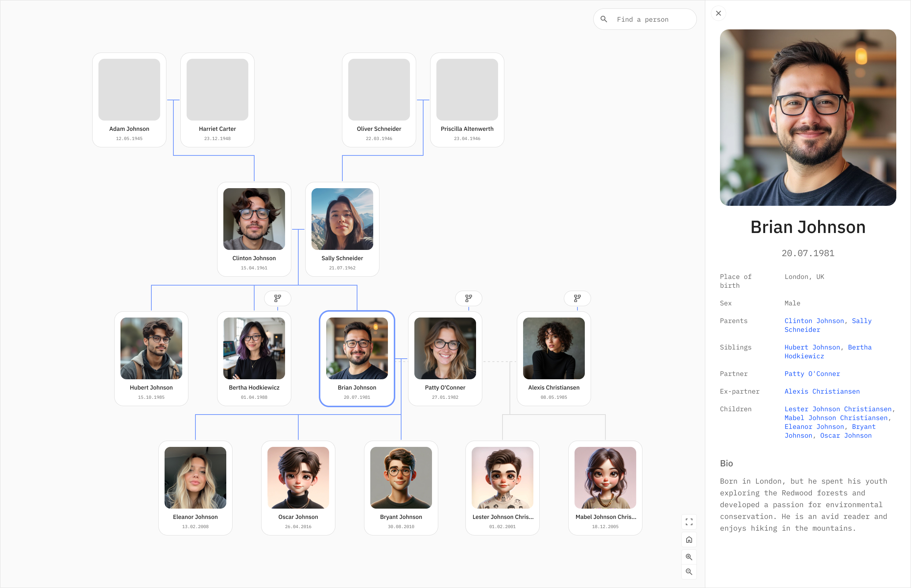

# Family Tree

Interactive family tree viewer built with React and [React Flow](https://reactflow.dev/). Store your family data in an [Obsidian](https://obsidian.md/) vault as markdown files, then visualize it as an explorable tree.



[Demo](https://family-tree.kotomanov.app)

## Features

- Interactive tree with pan, zoom, and click-to-explore
- Shows 3-4 generations around the selected person
- Sidebar with detailed person info (dates, places, relationships, bio)
- Search across all family members
- Expand buttons to navigate deeper into sub-trees
- Orthogonal connector lines with spouse/ex-partner distinction
- Optional GEDCOM import from MyHeritage or other services

## Quick Start

The project comes with sample data so you can try it immediately:

```bash
# 1. Install dependencies
cd scripts && npm install
cd ../family-tree-app && npm install

# 2. Generate family data from sample vault
cd ../scripts
node generate-json.js

# 3. Start the app
cd ../family-tree-app
npm run dev
```

Open http://localhost:5173 — you should see a sample family tree.

## Use Your Own Data

### Option A: Start with an Obsidian vault

1. Create a vault (or use an existing one) with one markdown file per person
2. Use this frontmatter format:

```yaml
---
Date of birth: 1981-07-20
Place of birth: London, UK
Sex: M
Parents:
  - "[[Parent Name]]"
Siblings:
  - "[[Sibling Name]]"
Partner: "[[Partner Name]]"
Ex-partners:
  - "[[Ex Name]]"
Children:
  - "[[Child Name]]"
---
# Person Name

## Bio
Some text about this person.
```

3. Configure the scripts to point to your vault:

```bash
cd scripts
cp .env.example .env
```

Edit `scripts/.env`:
```
VAULT_PATH=/path/to/your/obsidian/vault
ROOT_PERSON=Your Name
```

4. Generate and run:
```bash
node generate-json.js
cd ../family-tree-app && npm run dev
```

### Option B: Import from GEDCOM

If you have a GEDCOM export (from MyHeritage, Ancestry, etc.):

1. Set up your `.env` with both vault and GEDCOM paths:
```
VAULT_PATH=/path/to/your/obsidian/vault
ROOT_PERSON=Your Name
GEDCOM_PATH=/path/to/your/export.ged
```

2. Run the sync pipeline:
```bash
cd scripts

# Parse and check for conflicts
node index.js --check-conflicts

# Review conflicts.md, then sync
node index.js --sync

# Generate JSON for the app
node generate-json.js
```

## Project Structure

```
Family tree/
├── sample-family/           # Sample Obsidian vault (fictional family)
│   ├── *.md                 # Person files
│   ├── Photos/              # Person photos
│   └── Templates/           # Obsidian template
│
├── scripts/                 # Data pipeline
│   ├── config.js            # Configuration (reads .env)
│   ├── generate-json.js     # Vault → data.json
│   ├── index.js             # GEDCOM sync CLI
│   ├── gedcom-parser.js     # GEDCOM parser
│   ├── obsidian-reader.js   # Vault reader
│   ├── matcher.js           # GEDCOM ↔ Obsidian matching
│   ├── obsidian-sync.js     # Sync GEDCOM to vault
│   └── .env.example         # Config template
│
└── family-tree-app/         # React web app
    ├── public/
    │   ├── data.json         # Generated (gitignored)
    │   └── photos/           # Copied from vault (gitignored)
    └── src/
        ├── styles/tokens.css # Design tokens
        ├── components/       # UI components
        └── utils/            # Layout engine
```

See [family-tree-app/README.md](family-tree-app/README.md) for technical architecture details.

## Configuration

All config is in `scripts/.env` (copy from `.env.example`):

| Variable | Default | Description |
|----------|---------|-------------|
| `VAULT_PATH` | `../sample-family` | Path to Obsidian vault |
| `ROOT_PERSON` | `Brian Johnson` | Home person in the tree |
| `GEDCOM_PATH` | *(empty)* | Path to GEDCOM file (optional) |
| `EXCLUDE_DIRS` | `Archive,Templates,.obsidian,Photos` | Dirs to skip when scanning |

## Tech Stack

- **Frontend**: React 19, Vite, React Flow 11
- **Data**: Obsidian markdown vault with YAML frontmatter
- **Styling**: Plain CSS with design tokens (IBM Plex Sans/Mono)
- **Import**: Custom GEDCOM parser (optional)

## License

MIT
